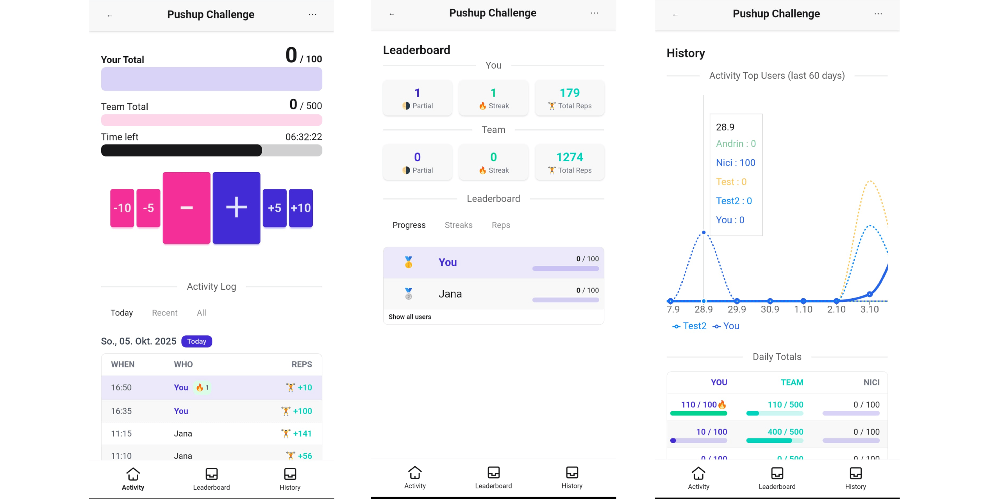

# Tack Tally
> A simple shared counter for daily challenges. Log reps, earn streaks, improve together.  
> https://tracktally.github.io/doc/
> 

Track Tally is a simple shared counter app for daily challenges. Set a target (e.g., 100 push-ups), log every rep, and see everyone’s progress in real time.



### Develop
This is a serverless web app. The database is hosted on [firebase](https://firebase.google.com/docs/firestore) (spark free plan). To host this app yourself, create a new firestore database and configure `app/src/firebase/config.ts`.

#### Firestore
See `./firestore` for rules.

#### Web

```bash
cd app
npm install
npm run dev -- --host
```
Use node >= v18.

#### Maintance Worker
A (separate) maintance worker script periodically resets the counters and updates the history and stats
for all challenges using firestore admin SDK. This way no cloud functions must be hosted (cloud functions are not part of free spark plan).

### Deploy

- master: https://tracktally.github.io/    
- develop: https://tracktally-dev.github.io/